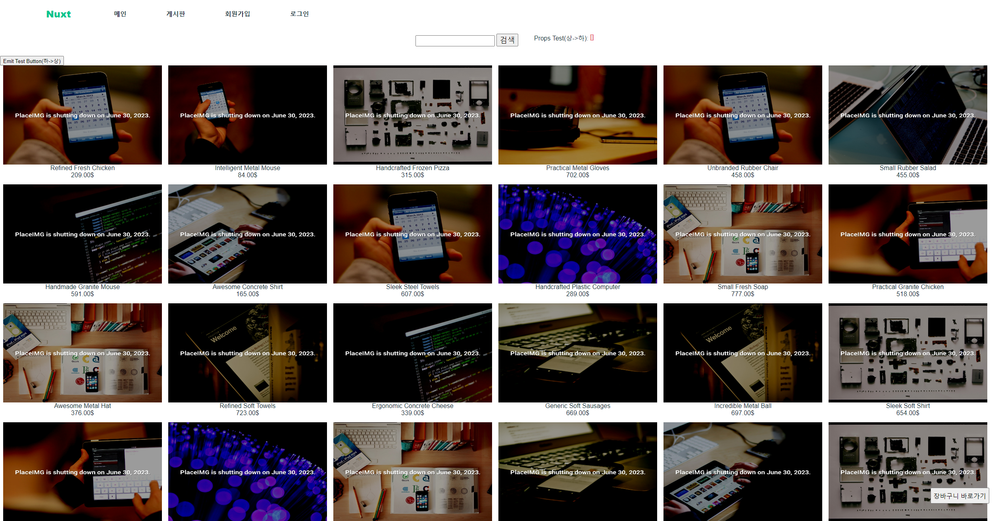

# learn-nuxt  

# 최초 실행시 라이브러리 설치
`npm install`

# 넉스트 실행
learn-nuxt 폴더에서 터미널 열기
`npm run dev` 넉스트 서버 실행

# 백엔드 서버 실행
backend 폴더로 이동 후 터미널 열기(backend README.md 참고)
`npm run dev` 백엔드 서버 실행

## 실행 화면

https://learn-nuxt-shop.netlify.app/

## SSG 방식 배포-Netlify 사용
1. nuxt.config.js 에서 target을 static으로 설정
2. `npm run generate`
3. dist 폴더 생김()

## 개발 환경 구성
- [Chrome](https://www.google.com/intl/ko/chrome/)
- [Visual Studio Code](https://code.visualstudio.com/)
- [Vue.js Dev Tools](https://chrome.google.com/webstore/detail/vuejs-devtools/nhdogjmejiglipccpnnnanhbledajbpd)
- [Node.js](https://nodejs.org/ko/)

## VSCode 플러그인 목록
- 색 테마 : [Night Owl](https://marketplace.visualstudio.com/items?itemName=sdras.night-owl)
- 파일 아이콘 테마 : [Material Icon Theme](https://marketplace.visualstudio.com/items?itemName=PKief.material-icon-theme)
- 뷰 확장 플러그인 : [Vetur](https://marketplace.visualstudio.com/items?itemName=octref.vetur)
- 뷰 코드 스니펫 : [Vue VSCode Snippets](https://marketplace.visualstudio.com/items?itemName=sdras.vue-vscode-snippets)
- 문법 검사 : [ESLint](https://marketplace.visualstudio.com/items?itemName=dbaeumer.vscode-eslint), [Prettier](https://marketplace.visualstudio.com/items?itemName=esbenp.prettier-vscode), [ES6 String HTML](https://marketplace.visualstudio.com/items?itemName=Tobermory.es6-string-html)
- 실습 환경 보조 : [Live Server](https://marketplace.visualstudio.com/items?itemName=ritwickdey.LiveServer)
- 기타
  - [Project Manager](https://marketplace.visualstudio.com/items?itemName=alefragnani.project-manager), [Auto Close Tag](https://marketplace.visualstudio.com/items?itemName=formulahendry.auto-close-tag), [GitLens](https://marketplace.visualstudio.com/items?itemName=eamodio.gitlens), [Atom Keymap](https://marketplace.visualstudio.com/items?itemName=ms-vscode.atom-keybindings), [Jetbrains IDE Keymap](https://marketplace.visualstudio.com/items?itemName=isudox.vscode-jetbrains-keybindings) 등
