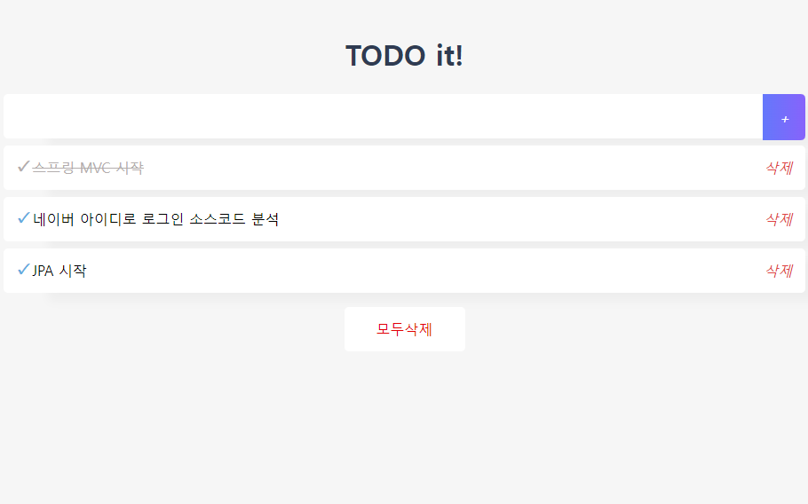

# vue-todo
간단하게 할 일을 등록, 체크, 삭제할 수 있는 애플리케이션
데이터는 브라우저 로컬 스토리지 저장 및 삭제 하므로 앱을 재시작 하면 데이터는 사라짐




## Project setup
```
npm install
```

### Compiles and hot-reloads for development
```
npm run serve
```

### Compiles and minifies for production
```
npm run build
```


