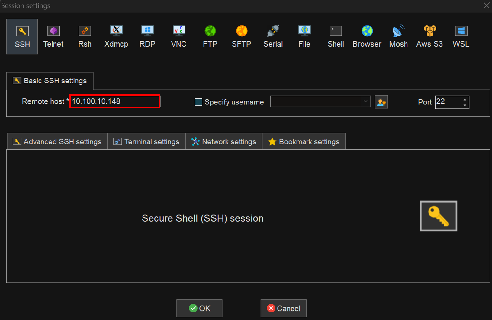
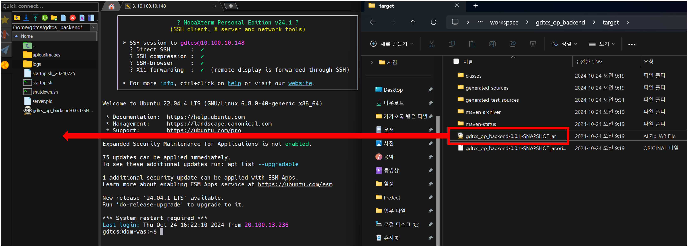

## 세팅

### mobaxterm 세팅

> 1. Session<br/> > <br/> > **운영**
>    SSH <br/> > [10.66.1.31]<br/>
>    Root - ID: root / PW: qhdks1!<br/>
>    gdtcs - ID: gdtcs / PW: tcs2025!!<br/> > <br/> > **개발**
>    SSH <br/> > [10.100.10.148]<br/>
>    Root - ID: root / PW: root123!!!<br/>
>    WEB/WAS - ID: gdtcs / PW: gdtcs123!!!<br/>

## 백업

장애 발생시 신속한 복원을 위해 시스템 프로그램을 백업한다.

> 1. jar파일 백업
>
> - 예) mv gdtcs_op_backend-0.0.1-SNAPSHOT.jar gdtcs_op_backend-0.0.1-SNAPSHOT.jar_backup_오늘날짜


## 배포

> 1. 이클립스 <br/>
>    프로젝트 우클릭 - Run as - Maven Build.. - Goals에만 clean package 입력 - Run - 해당폴더의 target으로 이동
> 2. springboot_gdtcs.service 중지한다고 알리고 중지
>     
>
> ```text
>   광안대교 운영단말 백엔드서버 중지 하겠습니다.
>   X월 X일 까지 개발분 반영하겠습니다.
>   10분 뒤에 재기동 하겠습니다.
> ```
>
> 3. mobaxterm에서 로그 띄우기

     개발: tail -f /home/gdtcs/gdtcs_backend/logs/out.log
     운영: tail -f /home/gdtcs/gdtcs_backend/logs/out.log

> 4. mobaxterm service 명령어로 중지

     sudo systemctl stop springboot_gdtcs.service

> 5. gdtcs_op_backend-0.0.1-SNAPSHOT.jar파일 mobaxterm으로 드래그 드랍
>     
>
>
> 6.  springboot_gdtcs.service 재시작

      sudo systemctl start springboot_gdtcs.service

> 7.  운영/개발에서 로그확인 후 프로그램 동작 확인

## 참고사항

> 1. 기존에 ./startup.sh로 실행했다면 반드시 ./shutdown.sh를 입력
>    
> 2. out.log에 메세지가 안올라온다면
>    1. netstat -tnlf로 해당 프로젝트가 실행중인지 확인
>    2. systemctl status springboot_gdtcs.service로 관련 메세지 확인
>    3. out.log의 권한이 root인지 확인하기
>   
>     
>