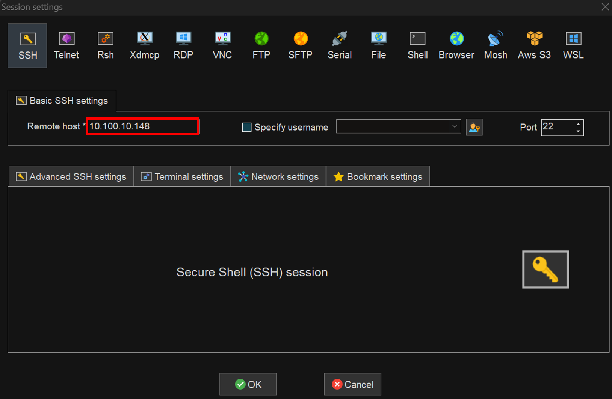

# 젠킨스 가이드

## 세팅

### 젠킨스 설치 참고

> https://gksdudrb922.tistory.com/195

### 광안대교 젠킨스 정보

> 젠킨스 설치 주소 : 10.100.10.148
>
> **젠킨스 웹 접속 정보**  
> 포트 : 8082  
> ID: admin  
> PW: admin1234  
>
> **젠킨스 깃랩 계정 정보**  
> ID: jenkins_road  
> PW: xmxmxm!!!  

### mobaxterm 세팅

> 1. Session   
>    개발 SSH  
>    [내부: 10.100.10.148]  
>    Root - ID: root/ PW: root123!!!  
>    Jenkins - ID: jenkins / PW: jenkins123!!!  

## 젠킨스 웹 자동배포 세팅

>    
> Repository URL : git clone 주소  
> Credentials : 깃랩 계정 정보(ID/PW)  
>
>    
> Secret token : 복사 후 깃랩 Webhook Secret Token에 붙여넣기  
>
>    
> Build Step : 버전에 맞는 빌드 도구 사용 (없을 경우 Execute Shell로 직접 빌드)  
> Execute shell : 빌드 후 배포를 위한 추가 작업 작성  
>
> - 권한 관련 오류가 많이 뜨기 때문에 권한 설정이 필요함 (파일을 지우고, 옮기는 거 때문에)  
>
>   sudo visudo  
>   사용자계정 ALL=(ALL) NOPASSWD: ALL  
>   입력 하면 sudo를 입력해도 비밀번호를 묻지않음  
>
> ## 깃랩 자동배포 웹훅 세팅
>
>    
>
> URL: Jenkins 웹에서 생성한 프로젝트 경로  
> Secert Token : Jenkins 웹에서 복사한 Sercet Token  
> SSL enable 끄기  
