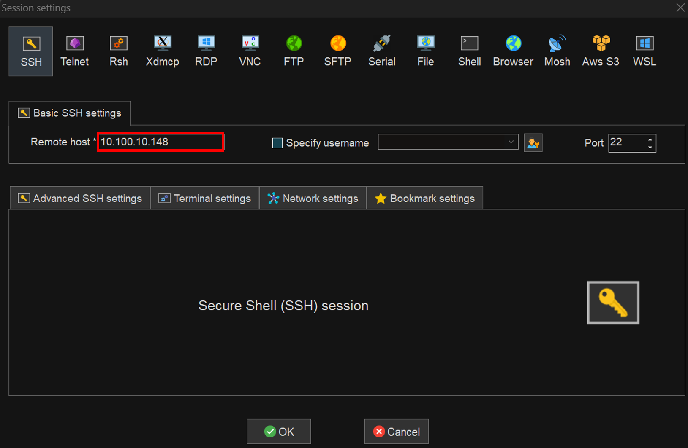
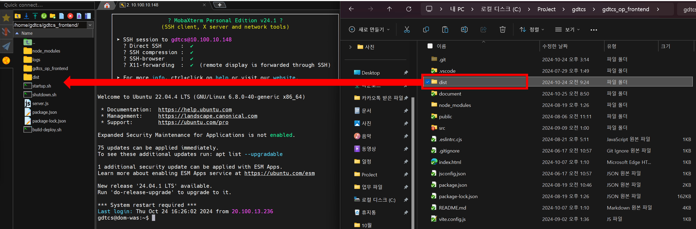

## 세팅

### mobaxterm 세팅

> 1. Session<br/> > <br/> > **운영**
>    SSH <br/> > [10.66.1.31]<br/>
>    Root - ID: root / PW: qhdks1!<br/>
>    gdtcs - ID: gdtcs / PW: tcs2025!!<br/> > <br/> > **개발**
>    SSH <br/> > [10.100.10.148]<br/>
>    Root - ID: root / PW: root123!!!<br/>
>    WEB/WAS - ID: gdtcs / PW: gdtcs123!!!<br/>

## 백업

장애 발생시 신속한 복원을 위해 시스템 프로그램을 백업한다.

> 1. dist 폴더 백업
>
> - 예) mv dist dist_backup_오늘날짜


## 배포
광안대교 프론트엔드는 Express 웹서버를 사용 중 이므로 
빌드된 dist 폴더를 /home/gdtcs/gdtcs_frontend 경로에 가져다놓기만 하면
재기동 할 필요 없이 자동으로 배포된다.
운영환경 배포시 끝에 :prod 를 꼭 명시하여 빌드해야 한다.


> ```text
> 개발환경 배포시 npm run build
> 운영환경 배포시 npm run build:prod
> ```

> 1. vscode <br/>
>   개발 환경
>   터미널 - npm run build - 해당폴더로 이동
>   운영 환경
>   터미널 - npm run build:prod - 해당폴더로 이동
>
> ```text
>   광안대교 운영단말 프론트서버 중지 하겠습니다.
>   X월 X일 까지 개발분 반영하겠습니다.
>   10분 뒤에 재기동 하겠습니다.
> ```


> 2. dist 폴더 mobaxterm으로 드래그 드랍
>     
>
>

> 3.  운영/개발에서 로그확인 후 프로그램 동작 확인

      systemctl status nodejs_gdtcs.service

## 참고사항

> 1. 기존에 ./startup.sh로 실행했다면 반드시 ./shutdown.sh를 입력
>    
> 2. access.log에 메세지가 안올라온다면
>    1) netstat -tnlf로 해당 프로젝트가 실행중인지 확인
>    2) systemctl status nodejs_gdtcs.service로 관련 메세지 확인
>    3) access.log의 권한이 root인지 확인하기